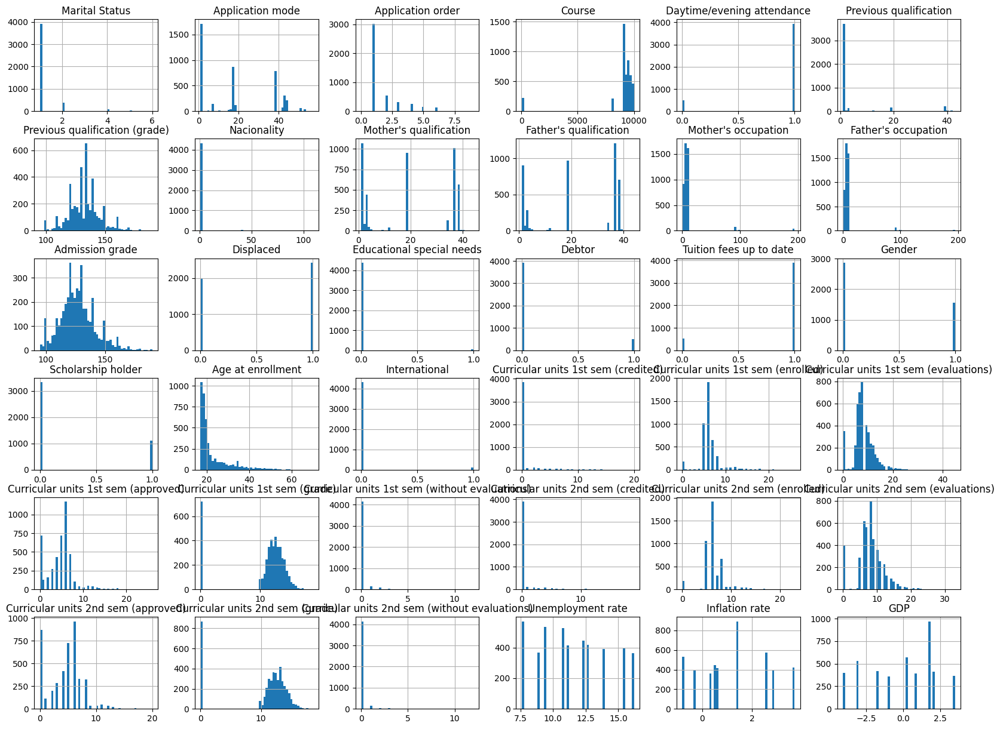
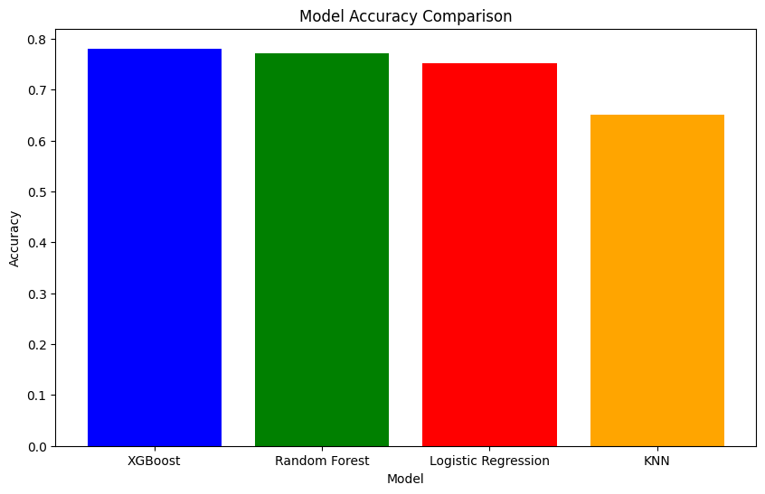

# Laporan Proyek Machine Learning - Yulianto Aryaseta

## Domain Proyek

Permasalahan dropout mahasiswa masih menjadi tantangan serius di berbagai institusi pendidikan tinggi. Tingkat kelulusan yang rendah tidak hanya mencerminkan efektivitas sistem pembelajaran, tetapi juga berdampak pada reputasi institusi dan beban biaya yang ditanggung mahasiswa serta keluarganya. Menurut laporan World Bank (2021), satu dari lima mahasiswa di negara berkembang berisiko tidak menyelesaikan studi tepat waktu, atau bahkan putus kuliah sebelum meraih gelar [1].

Masalah ini sangat kompleks karena dipengaruhi oleh kombinasi faktor akademik dan non-akademik, termasuk latar belakang keluarga, kondisi ekonomi, kinerja akademik, serta faktor psikososial. Oleh karena itu, pendekatan prediktif berbasis data sangat dibutuhkan untuk membantu institusi pendidikan dalam melakukan deteksi dini terhadap mahasiswa yang berpotensi mengalami kegagalan studi.

Dalam proyek ini, dibangun sebuah sistem klasifikasi berbasis machine learning yang memanfaatkan algoritma XGBoost Classifier. XGBoost dikenal sebagai salah satu algoritma klasifikasi berbasis ensemble yang sangat efisien dan memiliki akurasi tinggi dalam banyak kasus prediktif. Model ini dilatih menggunakan dataset yang berisi 37 fitur, di antaranya: status pernikahan, usia saat masuk kuliah, gender, nilai ujian, jumlah mata kuliah yang diambil dan disetujui, hingga indikator ekonomi seperti inflasi dan PDB. Label target dari data ini diklasifikasikan menjadi dua kelas utama: dropout dan graduate success.

Tujuan utama dari sistem ini adalah untuk mengklasifikasikan mahasiswa berdasarkan kemungkinan mereka mengalami dropout atau berhasil menyelesaikan studinya. Dengan sistem ini, pihak kampus dapat mengidentifikasi kelompok risiko lebih awal dan menyusun strategi intervensi yang lebih efektif, seperti pendampingan akademik, beasiswa tambahan, atau konseling psikologis.

Beberapa penelitian terdahulu juga telah membuktikan efektivitas model klasifikasi dalam kasus serupa. Penelitian oleh Castro et al. (2020) menggunakan XGBoost untuk memprediksi dropout dan berhasil mencapai akurasi lebih dari 90% [2]. Studi lain oleh Umer et al. (2022) menekankan bahwa faktor akademik semester awal, seperti jumlah evaluasi dan nilai mata kuliah, sangat berkontribusi dalam model prediktif [3].

Dengan pendekatan ini, diharapkan sistem prediksi berbasis machine learning dapat menjadi alat bantu pengambilan keputusan yang berdampak nyata dalam meningkatkan kualitas pendidikan tinggi dan mengurangi angka kegagalan studi khususnya di Indonesia.

## Business Understanding

Dalam dunia pendidikan tinggi, menjaga tingkat retensi mahasiswa merupakan tantangan utama yang harus dihadapi oleh institusi akademik. Tingginya angka mahasiswa yang mengalami dropout atau tidak menyelesaikan studi tepat waktu dapat berdampak buruk terhadap reputasi universitas, efisiensi pengelolaan sumber daya, dan masa depan akademik mahasiswa itu sendiri. Untuk itu, dibutuhkan sebuah sistem yang mampu mengidentifikasi mahasiswa yang berisiko tinggi agar dapat diberikan intervensi sedini mungkin.

### Problem Statements

1. Bagaimana cara mengidentifikasi mahasiswa yang berpotensi mengalami dropout berdasarkan data historis yang tersedia?
   - Banyak institusi kesulitan dalam melakukan prediksi dropout karena kurangnya alat prediktif yang mampu menangkap berbagai faktor kompleks seperti prestasi akademik, kondisi sosial ekonomi, dan faktor pribadi lainnya.

2. Bagaimana meningkatkan kualitas layanan akademik dengan pemanfaatan data secara efektif?
   - Informasi yang tersebar di berbagai sistem informasi akademik sering kali belum digunakan secara optimal untuk mendukung pengambilan keputusan yang berbasis data.

3. Apa saja fitur yang paling berpengaruh terhadap keberhasilan studi mahasiswa?
   - Memahami fitur penting akan membantu universitas dalam merancang program intervensi yang lebih tepat sasaran, seperti pemberian beasiswa, konseling, atau penyesuaian kurikulum.

### Goals

1. Membangun model prediksi dropout mahasiswa menggunakan algoritma machine learning berbasis XGBoost.
   - Model ini akan dilatih menggunakan data yang mencakup aspek akademik dan non-akademik mahasiswa dengan target prediksi berupa status kelulusan.

2. Memberikan sistem klasifikasi yang dapat diintegrasikan ke dalam sistem pengelolaan akademik untuk mendukung intervensi dini.
   - Output dari model prediksi dapat digunakan oleh dosen pembimbing, bagian kemahasiswaan, atau pusat layanan akademik sebagai dasar tindakan.

3. Mengidentifikasi fitur-fitur penting (feature importance) dalam menentukan keberhasilan studi mahasiswa.
   - Hasil analisis feature importance dari model XGBoost dapat dimanfaatkan untuk menyusun kebijakan atau program pendukung mahasiswa yang lebih efektif.

### Solution statements

1. Menggunakan algoritma XGBoost Classifier sebagai baseline model prediktif.
   - XGBoost dikenal karena keunggulannya dalam menangani data tabular, akurasi yang tinggi, serta interpretabilitas terhadap kontribusi fitur melalui feature importance. Model akan dievaluasi menggunakan metrik seperti accuracy, precision, recall, dan F1-score.

2. Melakukan hyperparameter tuning pada model XGBoost untuk meningkatkan performa.
   - Akan dilakukan pencarian kombinasi terbaik dari parameter seperti learning_rate, n_estimators, dan max_depth menggunakan metode seperti GridSearchCV atau RandomizedSearchCV untuk menghindari overfitting dan meningkatkan generalisasi model.

3. Mengevaluasi dan membandingkan hasil prediksi dengan algoritma alternatif seperti Random Forest dan Logistic Regression.
   - Dengan membandingkan performa beberapa model, kita dapat memastikan bahwa solusi terbaik telah dipilih untuk diadopsi dalam praktek nyata.

## Data Understanding

Dataset yang digunakan dalam proyek ini berasal dari Kaggle, yaitu [Student Dropout and Academic Success](https://www.kaggle.com/datasets/adilshamim8/predict-students-dropout-and-academic-success). Dataset ini dikembangkan sebagai bagian dari proyek nasional di Portugal yang bertujuan untuk mengurangi angka dropout dan kegagalan akademik di institusi pendidikan tinggi.

Dataset ini berisi informasi lengkap mengenai 4.424 mahasiswa dari 8 program studi yang berbeda, seperti Agronomi, Desain, Pendidikan, Keperawatan, Jurnalisme, Manajemen, Pelayanan Sosial, dan Teknologi. Tujuan utama dari dataset ini adalah untuk mendukung sistem intervensi dini dengan memprediksi kemungkinan hasil akademik mahasiswa, yaitu:

- Dropout (Berhenti Studi)
- Enrolled (Masih Terdaftar)
- Graduate (Lulus)

Masalah ini diformulasikan sebagai klasifikasi tiga kelas (multiclass classification) dengan tantangan ketidakseimbangan kelas (class imbalance), menjadikannya skenario yang realistis untuk penerapan machine learning di bidang edukasi.

Ringkasan Dataset:
- Jumlah Observasi (Rows): 4.424 mahasiswa
- Jumlah Fitur (Columns): 36 fitur
- Jenis Data: Numerik (integer & float) dan kategorikal
- Fitur Target: 'Target' (kategori: Dropout, Enrolled, Graduate)
- Status Data: Sudah melalui proses pembersihan (tidak ada missing values)

### Variabel-variabel pada Student Dropout and Academic Success:

1. Demografis & Sosial Ekonomi
   - Marital status: Status pernikahan mahasiswa
   - Application mode: Mode pendaftaran mahasiswa ke universitas
   - Application order: Urutan pilihan program studi saat mendaftar
   - Course: Program studi mahasiswa
   - Daytime/evening attendance: Jadwal kuliah (pagi/sore)
   - Previous qualification: Pendidikan terakhir sebelum masuk universitas
   - Previous qualification grade: Nilai pendidikan sebelumnya (0–200)
   - Nationality: Kewarganegaraan
   - Mother's qualification: Pendidikan terakhir ibu
   - Father's qualification: Pendidikan terakhir ayah
   - Mother's occupation: Pekerjaan ibu
   - Father's occupation: Pekerjaan ayah
   - Displaced: Apakah mahasiswa berasal dari luar kota/tempat tinggal utama
   - Educational special needs: Apakah mahasiswa memiliki kebutuhan khusus
   - Debtor: Apakah mahasiswa memiliki utang akademik
   - Tuition fees up to date: Apakah pembayaran kuliah lancar
   - Gender: Jenis kelamin
   - Scholarship holder: Penerima beasiswa
   - Age at enrollment: Usia saat mendaftar kuliah
   - International: Apakah mahasiswa merupakan mahasiswa internasional

2. Riwayat Akademik
   - Curricular units 1st sem (credited, enrolled, evaluated, approved, grade, without evaluations): Informasi akademik semester 1
   - Curricular units 2nd sem (credited, enrolled, evaluated, approved, grade, without evaluations): Informasi akademik semester 2
   - Unemployment rate: Tingkat pengangguran saat tahun masuk kuliah
   - Inflation rate: Tingkat inflasi saat tahun masuk kuliah
   - GDP: Produk domestik bruto saat tahun masuk kuliah
   - Target: Label/kelas output (Dropout, Enrolled, Graduate)

### Exploratory Data Analisis

Untuk memahami distribusi awal dari setiap fitur dalam dataset, dilakukan visualisasi menggunakan histogram. Gambar di atas menggambarkan distribusi dari 36 fitur numerik dan kategorikal dalam dataset. Berikut beberapa temuan penting dari hasil eksplorasi data:

1. Distribusi Biner dan Kategorikal
   - Beberapa fitur biner seperti:
   - Gender, Displaced, Educational special needs, Scholarship holder, International, Debtor, dan Tuition fees up to date menunjukkan distribusi yang sangat tidak seimbang. Contohnya, sebagian besar mahasiswa tidak memiliki kebutuhan khusus dan bukan penerima beasiswa.
   - Daytime/evening attendance juga didominasi oleh salah satu kelas (kemungkinan mahasiswa pagi).
   - Fitur kategorikal seperti Marital status, Application mode, Course, Mother's/Father's occupation, dan Previous qualification menunjukkan bahwa beberapa kategori sangat dominan, sementara kategori lain sangat jarang muncul, yang bisa berdampak pada generalisasi model.

2. Distribusi Numerik
   - Fitur seperti Age at enrollment menunjukkan distribusi right-skewed di mana mayoritas mahasiswa berusia antara 17–25 tahun, namun ada outlier dengan usia lebih dari 60 tahun.
   - Admission grade dan Previous qualification grade memiliki distribusi normal dengan sedikit skewness ke kiri, berkisar antara 80 hingga 200 poin.
   - Curricular units di semester 1 dan 2 seperti approved, grade, enrolled, dan evaluations menunjukkan distribusi yang sangat skewed ke kanan dengan banyak mahasiswa memiliki nilai/aktivitas rendah.
   - Fitur ekonomi makro seperti GDP, Unemployment rate, dan Inflation rate memiliki variabilitas cukup tinggi dan distribusi yang terfragmentasi, kemungkinan karena hanya mencerminkan beberapa tahun akademik tertentu.

3. Potensi Masalah
   - Beberapa fitur memiliki outlier ekstrem, seperti pada Age at enrollment, Previous qualification grade, dan GDP, yang perlu dipertimbangkan dalam proses praproses data.
   - Terdapat ketidakseimbangan kelas yang jelas dalam beberapa fitur biner dan kategorikal, yang bisa memengaruhi performa model jika tidak diatasi dengan teknik tertentu seperti oversampling atau class weight.

## Data Preparation

Dalam proses data preparation yang dilakukan, beberapa tahapan penting diterapkan untuk memastikan data siap digunakan dalam model machine learning. Berikut adalah penjelasan rinci mengenai setiap tahapan yang dilakukan, alasan mengapa tahapan tersebut diperlukan, dan teknik yang digunakan:

1. Mengidentifikasi dan Menangani Missing Values
   - Proses: Pertama-tama, kami memeriksa apakah ada nilai yang hilang dalam dataset menggunakan fungsi isnull().sum(). Hal ini untuk mengetahui apakah terdapat nilai yang hilang yang perlu ditangani, karena nilai yang hilang dapat menyebabkan kesalahan dalam model atau analisis.
   - Alasan: Nilai yang hilang dapat menurunkan kualitas model. Mengatasinya dengan cara mengisi atau menghapus nilai hilang adalah langkah penting agar model dapat berjalan dengan lancar dan menghasilkan prediksi yang lebih akurat.

2. Mengidentifikasi dan Menghapus Duplikasi Data
   - Proses: Dengan menggunakan df.duplicated(), kami memeriksa apakah ada baris yang duplikat dalam dataset. Data duplikat bisa merusak analisis dan model karena dapat memberikan bobot berlebih pada baris yang sama.
   - Alasan: Duplikasi data bisa menyebabkan bias dalam analisis dan mempengaruhi hasil model. Oleh karena itu, duplikasi harus dihapus untuk menjaga integritas data.

3. Penanganan Outliers (Nilai Pencilan)
   - Proses: Kami menggunakan Interquartile Range (IQR) untuk mengidentifikasi dan membatasi (cap) outliers pada kolom numerik. Outliers adalah nilai yang sangat jauh dari nilai lainnya dan bisa menyebabkan model gagal mempelajari pola yang sebenarnya.
   - Alasan: Outliers dapat mengganggu performa model, terutama pada model berbasis jarak. Dengan membatasi outliers, kami memastikan bahwa model tidak terpengaruh oleh data ekstrem yang tidak representatif.

4. Penghapusan Kategori Langka pada Kolom Kategorikal
   - Proses: Pada kolom kategorikal, kami mengidentifikasi kategori langka (kategori yang memiliki frekuensi < 1%) dan mengganti kategori tersebut dengan label 'Other'. Hal ini dilakukan untuk mengurangi jumlah kategori yang sangat sedikit dan kemungkinan besar tidak memberikan informasi signifikan.
   - Alasan: Kategori langka bisa menambah kompleksitas model tanpa memberikan kontribusi berarti. Menghapus atau menggabungkannya menjadi 'Other' membuat model lebih sederhana dan lebih efisien.

5. Normalisasi Data
   - Proses: Kami menggunakan StandardScaler untuk melakukan normalisasi pada fitur numerik. Teknik ini mengubah data sehingga memiliki distribusi dengan rata-rata 0 dan standar deviasi 1. Ini membantu model machine learning bekerja dengan lebih efisien, terutama pada algoritma yang sensitif terhadap skala fitur.
   - Alasan: Dengan melakukan normalisasi, kita memastikan bahwa setiap fitur memiliki kontribusi yang setara dalam pelatihan model.

6. Penyeimbangan Kelas (Balancing the Classes)
   - Proses: Kami menggunakan SMOTE (Synthetic Minority Over-sampling Technique) untuk menyeimbangkan jumlah sampel antara kelas mayoritas dan minoritas pada data pelatihan. Teknik ini menghasilkan data sintetis untuk kelas minoritas sehingga distribusi kelas menjadi lebih seimbang.
   - Alasan: Pada dataset dengan ketidakseimbangan kelas yang besar, model cenderung lebih memprediksi kelas mayoritas. Dengan menyeimbangkan kelas, kita dapat meningkatkan kemampuan model dalam memprediksi kelas minoritas dengan lebih akurat.

## Modeling

Pada tahap pemodelan ini, kami menggunakan XGBoost (Extreme Gradient Boosting) dengan algoritma XGBClassifier untuk menyelesaikan permasalahan klasifikasi pada dataset. Berikut adalah penjelasan terkait tahapan, parameter yang digunakan, serta proses evaluasi model:

1. Inisialisasi dan Pelatihan Model
   - Algoritma: XGBClassifier adalah salah satu model gradient boosting yang populer, terkenal karena kemampuannya dalam menangani data besar dan model yang lebih kompleks. XGBoost bekerja dengan membangun serangkaian pohon keputusan dalam rangka meningkatkan akurasi model. XGBoost sering kali lebih unggul dalam hal kecepatan dan kinerja dibandingkan dengan algoritma lainnya.
   - Parameter Default: Model ini diinisialisasi tanpa pengaturan parameter khusus, yang menggunakan parameter default dari XGBClassifier. Beberapa parameter penting yang digunakan pada model ini termasuk:
     - learning_rate: Mengontrol seberapa besar kontribusi setiap pohon dalam pembelajaran.
     - max_depth: Kedalaman maksimum dari pohon keputusan.
     - n_estimators: Jumlah pohon keputusan yang akan dibangun.
     - objective: Fungsi tujuan yang digunakan untuk klasifikasi multi-kelas.

### Kelebihan dan Kekurangan XGBoost

Kelebihan dan Kekurangan XGBClassifier
Kelebihan:
- Akurasi tinggi: XGBoost dikenal memiliki akurasi yang sangat baik, bahkan pada dataset besar dengan banyak fitur.
- Kemampuan menangani missing values dan outliers: Model ini dapat menangani nilai yang hilang dan outliers dengan baik tanpa memerlukan preprocessing yang berlebihan.
- Kecepatan dan Efisiensi: XGBoost sangat cepat dalam pelatihan dan prediksi karena optimisasi yang dilakukan pada level pohon keputusan.

Kekurangan:
- Sensitif terhadap parameter: Meskipun secara default sangat kuat, model ini sangat bergantung pada pengaturan parameter untuk mendapatkan performa terbaik.
- Kesulitan dengan data yang sangat tidak seimbang: Meskipun SMOTE digunakan untuk penyeimbangan kelas, XGBoost mungkin masih mengalami kesulitan dalam menangani ketidakseimbangan kelas yang ekstrem tanpa penyesuaian lebih lanjut.

### Analisis Pemilihan Model Terbaik:

Dari hasil evaluasi, model XGBoost dipilih sebagai model terbaik untuk solusi ini dengan alasan sebagai berikut:

Akurasi Tertinggi: XGBoost menghasilkan akurasi tertinggi yaitu 78.10%, yang lebih baik dibandingkan dengan model lain seperti Random Forest (77.20%), Logistic Regression (75.17%), dan KNN (65.01%).

Kinerja yang Baik di Semua Kelas:
- Meskipun performa pada kelas 1 (kelas minoritas) tidak terlalu tinggi, XGBoost tetap menunjukkan performa yang lebih baik dibandingkan model lain, dengan recall 0.51 dan precision 0.50.
- Untuk kelas 0 dan 2, XGBoost menunjukkan kinerja yang sangat baik, dengan precision dan recall yang tinggi, yaitu 0.84 dan 0.75 untuk kelas 0, serta 0.85 dan 0.90 untuk kelas 2.

Rata-rata Makro dan Tertimbang yang Seimbang:
- XGBoost memiliki rata-rata makro yang lebih seimbang antara precision, recall, dan F1-score. Meskipun rata-rata untuk kelas 1 lebih rendah, model ini tetap menjaga keseimbangan yang baik di kelas lain.

Kelemahan Model Lain:
- Random Forest memiliki hasil yang sedikit lebih rendah daripada XGBoost, dengan akurasi 76.98%, dan performa pada kelas 1 juga kurang optimal.
- Logistic Regression juga memiliki akurasi yang lebih rendah dan menunjukkan hasil yang lebih buruk pada kelas 1, meskipun kelas 0 dan 2 cukup baik.
- KNN memiliki performa yang jauh lebih rendah di seluruh metrik, terutama dengan akurasi 65.01%, menjadikannya model yang tidak layak dipilih.

## Evaluation

Pada proyek ini, kita menggunakan beberapa metrik evaluasi untuk menilai kinerja model klasifikasi yang diterapkan pada data siswa. Metrik yang digunakan meliputi akurasi, precision, recall, dan F1 score. Masing-masing metrik ini memiliki tujuan yang berbeda, yang membantu kita memahami kinerja model secara lebih menyeluruh.

Akurasi (Accuracy):
Akurasi mengukur seberapa sering model melakukan prediksi yang benar. Metrik ini berguna untuk memberikan gambaran umum tentang kinerja model pada dataset yang seimbang. Namun, akurasi bisa menjadi metrik yang menyesatkan jika data tidak seimbang (misalnya, jika satu kelas lebih dominan daripada yang lain).

Precision (Presisi)
Precision mengukur seberapa tepat model dalam memprediksi kelas positif. Metrik ini penting jika kita ingin meminimalkan jumlah kesalahan tipe I (false positives). Dalam konteks ini, precision mengukur seberapa banyak prediksi untuk setiap kelas benar.

Recall (Sensitivitas)
Recall mengukur kemampuan model untuk menangkap seluruh kelas positif yang ada di dalam data. Recall sangat penting jika kita ingin meminimalkan kesalahan tipe II (false negatives), yang berarti kita ingin memastikan sebanyak mungkin kelas positif terdeteksi.

F1 Score
F1 score adalah rata-rata harmonis dari precision dan recall. Metrik ini berguna ketika kita ingin keseimbangan antara precision dan recall, terutama dalam kasus di mana keduanya sangat penting. F1 score memberikan gambaran yang lebih baik daripada akurasi dalam konteks data yang tidak seimbang.

Berdasarkan hasil evaluasi yang diperoleh, berikut adalah analisisnya:

Akurasi (Accuracy):
- Akurasi model ini sebesar 78%. Ini berarti model benar dalam memprediksi kelas pada 78% dari total data uji. Meskipun akurasi cukup baik, kita harus hati-hati jika ada ketidakseimbangan dalam jumlah data antar kelas yang dapat mempengaruhi hasil ini.

Precision:
- Kelas 0 (nilai 0): Precision sebesar 0.84, yang menunjukkan bahwa model cukup baik dalam memprediksi kelas 0. Artinya, ketika model memprediksi kelas 0, 84% dari prediksi tersebut benar.
- Kelas 1 (nilai 1): Precision sebesar 0.50, yang menunjukkan bahwa model kurang tepat dalam memprediksi kelas ini, dengan banyak false positives.
- Kelas 2 (nilai 2): Precision sebesar 0.85, yang sangat baik, artinya model sangat akurat dalam memprediksi kelas 2.

Recall:
- Kelas 0: Recall sebesar 0.75, yang berarti model berhasil menangkap 75% dari semua kelas 0 yang sebenarnya ada dalam data uji.
- Kelas 1: Recall sebesar 0.51, yang menunjukkan bahwa model hanya berhasil menangkap sekitar 51% dari kelas 1 yang seharusnya diprediksi.
- Kelas 2: Recall sebesar 0.90, yang sangat tinggi, menandakan bahwa model sangat baik dalam mengenali kelas 2 yang seharusnya ada.

F1 Score:
- Kelas 0: F1 score sebesar 0.80, menunjukkan keseimbangan yang baik antara precision dan recall untuk kelas ini.
- Kelas 1: F1 score sebesar 0.51, yang rendah, mencerminkan ketidakseimbangan antara precision dan recall pada kelas ini. Model memiliki kesulitan dalam memprediksi kelas 1 dengan baik.
- Kelas 2: F1 score sebesar 0.87, yang sangat baik, menunjukkan bahwa model memberikan performa terbaik pada kelas ini.

## Insight

Berdasarkan hasil analisis model, terdapat 5 faktor teratas yang paling berpengaruh dalam memprediksi hasil akademik mahasiswa. Faktor-faktor tersebut mencerminkan keterlibatan akademik dan komitmen administratif mahasiswa, dengan detail sebagai berikut:

1. Curricular units 2nd semester (approved) memiliki pengaruh tertinggi (0.1907). Ini menunjukkan bahwa kemampuan mahasiswa menyelesaikan mata kuliah di semester genap sangat menentukan kelulusan atau keberhasilan akademik mereka.

2. Tuition fees up to date (0.1583) menjadi indikator penting. Mahasiswa yang membayar biaya kuliah tepat waktu cenderung lebih stabil dan konsisten dalam perkuliahan, mencerminkan dukungan finansial dan tanggung jawab administrasi.

3. Curricular units 2nd sem (enrolled) (0.0581) dan 1st sem (enrolled) (0.0409) menunjukkan bahwa jumlah mata kuliah yang diambil juga berpengaruh. Terlalu sedikit atau terlalu banyak beban mata kuliah mungkin memengaruhi performa akademik.

4. Curricular units 1st sem (approved) (0.0391) juga menjadi sinyal bahwa pondasi akademik di semester awal penting dalam menentukan keberhasilan jangka panjang mahasiswa.

### ✅ Solusi dan Rekomendasi untuk Masa Depan

Berdasarkan insight di atas, beberapa solusi yang dapat diterapkan oleh institusi pendidikan adalah:

1. Monitoring Akademik Dini:
   - Fokus pada kemajuan akademik mahasiswa di semester awal dan kedua. Misalnya, memberikan program mentoring atau bimbingan belajar untuk membantu mahasiswa menyelesaikan mata kuliah dengan baik.

2. Dukungan Keuangan dan Konseling:
   - Karena keterlambatan pembayaran biaya kuliah berpengaruh negatif terhadap performa, perlu adanya fleksibilitas pembayaran, program beasiswa, atau pendampingan keuangan bagi mahasiswa dengan kendala ekonomi.

3. Manajemen Beban Studi:
   - Mendorong mahasiswa untuk mengambil beban mata kuliah yang proporsional sesuai kemampuan mereka. Ini dapat dicapai dengan menyediakan konsultasi akademik rutin sebelum proses KRS (pengambilan mata kuliah).

4. Peringatan Dini (Early Warning System):
   - Mengembangkan sistem peringatan berbasis data untuk mendeteksi mahasiswa yang memiliki risiko gagal sejak dini, berdasarkan data kehadiran, performa semester, dan histori pembayaran.

## Daftar Pustaka

[1] World Bank. (2021). Learning Poverty in the Time of COVID-19: A crisis within a crisis. https://www.worldbank.org/en/topic/education/publication/learning-poverty-in-the-time-of-covid-19

[2] Castro, M., Oliveira, M., & Silva, A. (2020). Early prediction of student dropout and academic failure using machine learning: A case study with Portuguese higher education data. Education and Information Technologies, 25, 4745–4763. https://doi.org/10.1007/s10639-020-10183-w

[3] Umer, S. R., Sherin, S., & Ahmad, M. (2022). A predictive model for student dropout using supervised machine learning techniques. Computers & Education: Artificial Intelligence, 3, 100076. https://doi.org/10.1016/j.caeai.2022.100076
